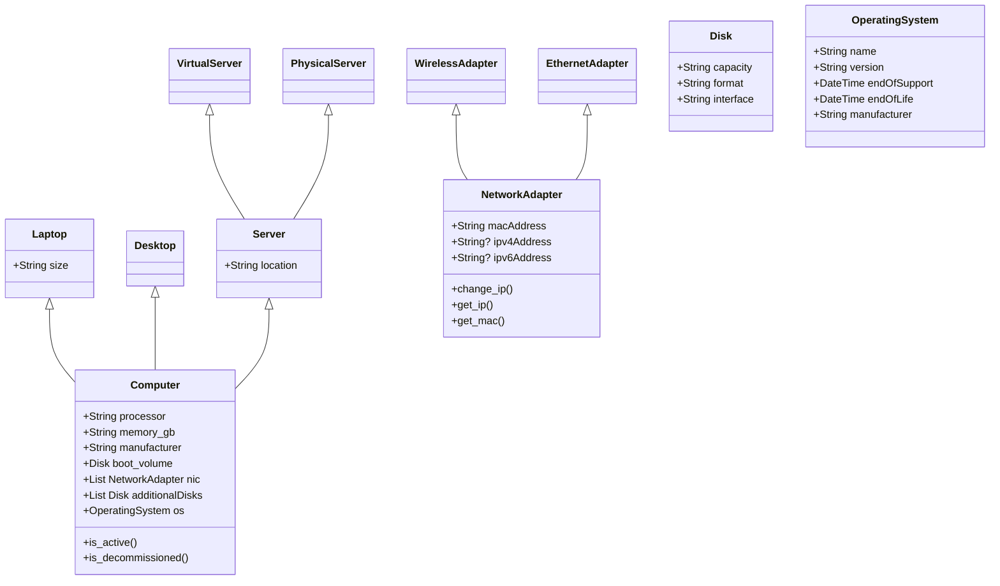

# tech-assayer

An simple application written in Python to track IT Assets in a no-sql database with a web front-end and simplified enough to use existing Ansible collections to gather data and write records.  Inspired by the need for something simple that can be easily modified for any organizations needs.

## Object definitions

